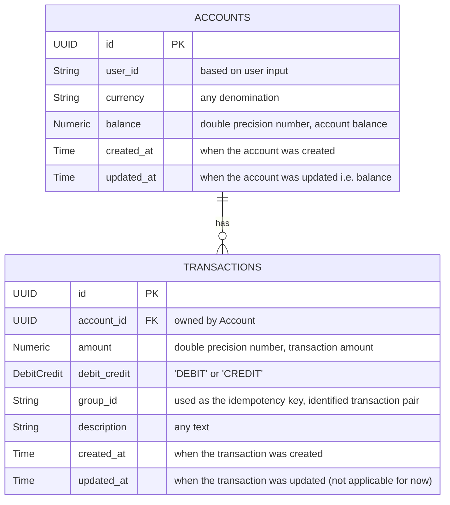

# wallet

Wallet as a service

[](https://github.com/devshark/wallet/actions/workflows/build-image.yaml)
[](https://github.com/devshark/wallet/actions/workflows/tests.yaml)
[](https://github.com/devshark/wallet/actions/workflows/integration-test.yaml)
[](https://github.com/devshark/wallet/actions/workflows/linter.yaml)
[](https://github.com/devshark/wallet/actions/workflows/fly-deploy.yml)

## Features

- Transfer currency from one account to another
- Double-entry ledger bookkeeping
  - Debited from one account
  - Credited to another account
- Company account
  - Is the liability account for all other account balances
- Deposit
  - Debited from Company account
  - Credited to User account
- Withdraw
  - Debited from User account
  - Credited to Company account
- Balance Enquiry
- View transaction history, starting from most recent.
  - Pagination yet to be designed

## Setup

### For Deployment

To run the application with dependencies, you only need Docker and Compose v3

```sh
docker compose --profile dev up --exit-code-from=app
```

### For Development

To run and compile the application, you will need the following:

1. Go v1.22
2. Docker and Docker Compose, to run postgres and redis containers
3. [golangci-lint](https://github.com/golangci/golangci-lint) to run linters i.e. `make lint`
4. `make` is normally already installed in Unix systems, otherwise consult how to install it.
5. [mockery](https://github.com/vektra/mockery) (optional)

Run the integration tests using

```sh
docker compose --profile integration up --exit-code-from=test --build
```

There are some commands prepared for you.

`make vendor` to install dependencies

`make build` to build the binary

`make test` to run full tests, including integration tests with a live database

`make short-test` to run tests that don't need external services

`make run-server` to run the application without building it. You can customize the environment variables as needed.

`make run-build` to build and run the application binary. You can customize the environment variables as needed.

`make lint` proxy of `golangci-lint run`

## Application structure

```code
├── Dockerfile              --- contains the application build instructions
├── api                     --- core interfaces for internal and external clients to use
├── app                     --- all application codes
│   ├── cmd                 --- entrypoint of the application
│   ├── internal            --- all non-shareable components of the application
│   │   ├── migration       --- application logic to migrate database scripts
│   │   └── repository      --- application logic for all external storage operations
│   └── rest                --- HTTP handlers to handle and expose RESTful services
├── client                  --- the client SDK for golang clients
├── docker-compose.yaml     --- How to orchestrate the application container with external services
├── migrations              --- all SQL files to migrate
├── postman                 --- all Postman related files
├── pkg                     --- external, shareable libraries
│   ├── env                 --- libraries to read env variables
│   └── middlewares         --- libraries for http middlewares
```

## Design decisions

### Development

I was using [mockery](https://github.com/vektra/mockery) to generate mocks of interfaces instead of hand-making mocks myself, to save time and maintenance.

I made my own database script migration logic, which usually comes from ORMs. I did not setup for the `down` scripts to save time and unnecessary test coverage for it.

I used the `github.com/shopspring/decimal` library as it is the standard for handling types that may need increased floating precision and [mathematical operations](https://0.30000000000000004.com/).

To reduce application bloatware, I created my own simple library for reading env variables, instead of libraries like [viper](https://github.com/spf13/viper).

I did not log much, especially for handled validations/errors. I only logged for unexpected errors.

### Short cuts

I made a few short cuts on the way to save time. A few known are:

- exceptional use of //nolint: in places where it makes sense i.e. to validate interface implementations
- No pagination in transaction history
- Minimal input validation
- Idempotency Key is required from client to avoid double spending. It could have been calculated on the service side, but we lack data algorithm and uniqueness per request, or grace period between similar requests. I consider "Idempotency Key" something similar to nonce, but is transactions-wide instead of source account-based.
- Some tests that rely on certain queries failing were not covered. I only added tests were database is not accessible to at least cover those scenarios, but it is not enough.

### Table design



I created two tables, accounts and transactions, to group related information such as currency and balance into accounts, and transactions details like amount, account id, timestamps.

I originally created only one table i.e. transactions, and thought to keep the running balance per transactions, but that implementation falls apart if I wanted to leverage ACID transactions and row-locking techniques. i.e. calculating the balances within the application vs via the database transactions.

This is a double-entry ledger because it is a generally acceptable bookkeeping strategy, and it aims to have zero sum (balanced) for assets and liabilities, and easy references.

There are no pagination at the moment as I was running out of time.

### Pessimistic locking implementation.

This leverages the ACID transactions into the database layer.
The alternative optimistic locking would leverage a fast and distributed data store like redis to handle the resource locking, but will require the application to handle internal retries for concurrent transfers, thus making the implementation more complex than needed. But if we can perform this, we will only need one table (transactions) and store the currency and running balance per row.

### Redis as caching layer only.

Although there are existing cloud or managed technologies that can already perform http caching, it is sometimes more preferable if the application handles its own caching. It benefits from having the capability to only cache certain endpoints i.e. specific transaction which will not change, but not others i.e. current account balance which may frequently change.

This is also another reason why I did not write integration tests with redis, as we only use it as a key-value store.

### Dockerfile and Compose

I used the same dockerfile for both production and testing purposes. I was leveraging the multi-stage builds aiming to make maintenance simpler.

All integration tests are contained within the docker compose services, which makes cleanup easier and I do not have to expose ports and configure networking.
